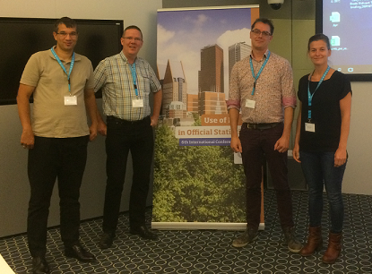

```{r setup, include=FALSE}
knitr::opts_chunk$set(echo = FALSE)
library(leaflet)
library(sf)
```

## Geocoding for nl

### The dev team:

- Egge-Jan Pollé (NL) - @EggePolle
- Willy Tadema (NL) - @FrieseWoudloper
- Edwin de Jonge (NL) - @edwindjonge
- Juris Breidaks (LV) - @CSB_Latvia



## What is it about?

### PDOK: dutch webservice

- Providing **location service**s as a Web API:
  - Search: "address",return: coordinates, regional administrative info (>30).
  - deduplicating addresses ("town road" vs "town street" vs "town alley")
- Providing geo **tile layer**s.
  - restricts topographic details to NL. 
  - style: "gray", "brt", "aerial" and "pastel"

## `nl_geocode`

- geocodes a list of addresses (location + 30 regional properties)
- modelled after `ggmap::geocode` same argument names.
- one location per address (with highest score).

    - for extra options use `nl_free`
    
- returns a `sf` object:

    - However: is `POINT`/ centroid, not the complete geometry.

- `type`: returned object should be: "address", "street", "postcode", "town", "municipality", "neighborhood", "province" etc.

## `nl_free`, `nl_suggest`, `nl_lookup`

wrap each pdok service faithfully: 

- same argument names as the web service
- all options available

However:

- _return value is also faithful, but complex, so more difficult to use_

## `addPdokTiles`

Utility function to provide pdok tiles in `leaflet`: maps for Dutch regions:

- brt: background (similar to OSM)
- gray: grayed-out background
- pastel: pastel tone background
- aerial: aerial/satelite background


```{r, eval = FALSE, echo=TRUE}
library(leaflet)
leaflet() %>% 
  addPdokTiles() %>% 
 # do your mapping thing
```

## Example

```{r, echo = TRUE, eval=TRUE}
library(nlgeocoder)
library(leaflet)
r <- nl_geocode("Henri Faasdreef 312") # uRos 2018 Conference!
leaflet() %>% addPdokTiles("gray") %>% 
  addMarkers(data = r, popup = "uRos2018!")
```
